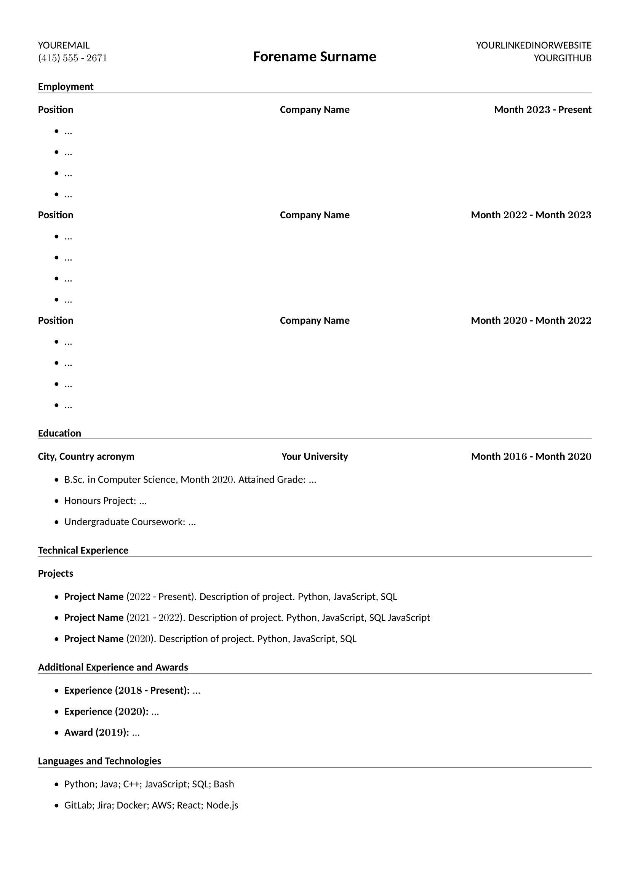

# wisals-cv-template
Simple LaTeX CV template that can be used by anyone at any stage of their career.

## Requirements
Template was built using [MikTeX](https://miktex.org/). Required packages can be installed when typesetting.

## Usage
Replace placeholder values with your own. The *Education* section can be moved above *Employment* if you are early into your career and do not have much experience. The *Additional Experience and Awards* section can also be renamed or removed depending on what stage of your career you are at, e.g. if you are early into your career, feel free to mention extracurricular activities.

## Example
